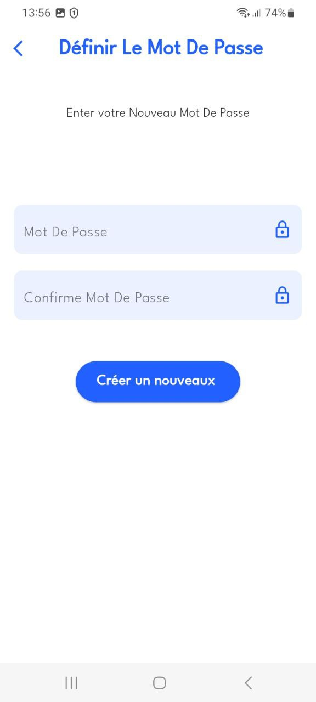
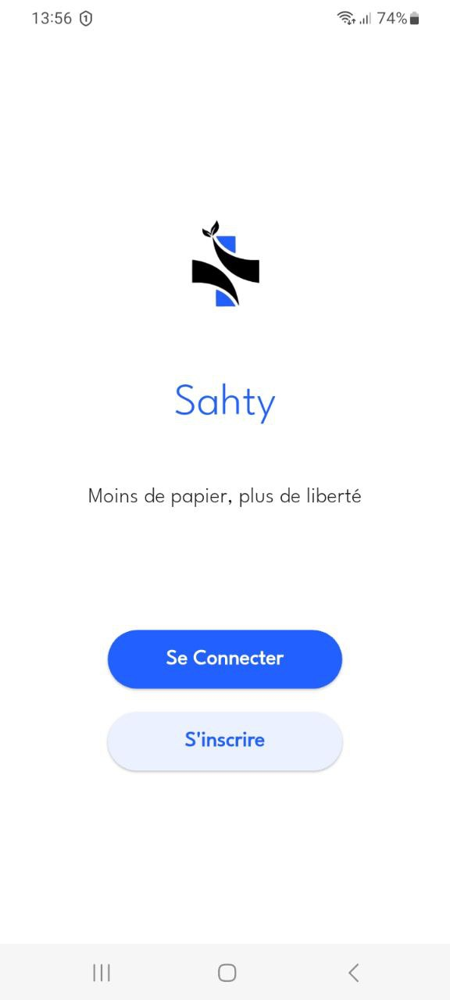
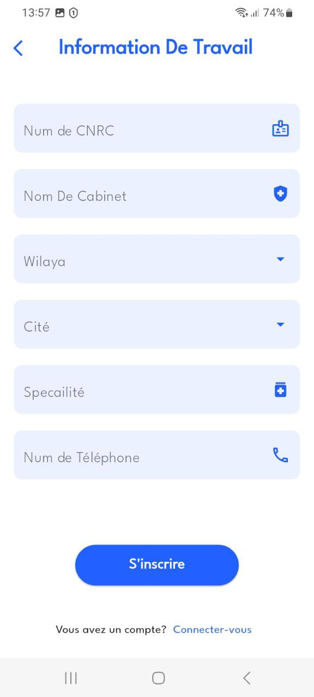
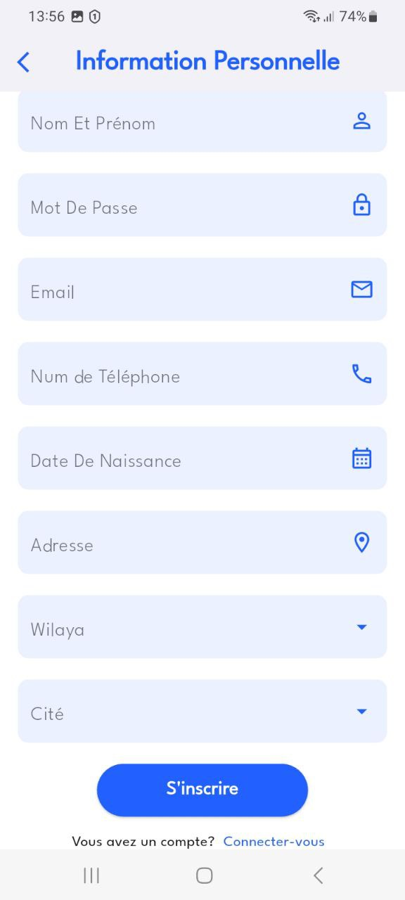

# Authentication and Registration Pages

This project includes a simple authentication and registration system for users(doctor,patient). The system allows users to log in an account and log in to access the main features of the application.

## Features

- **User Registration**: Allows users to sign up with their details.
- **User Authentication**: Provides login functionality to authenticate users with their registered credentials.

## ScreenShots

